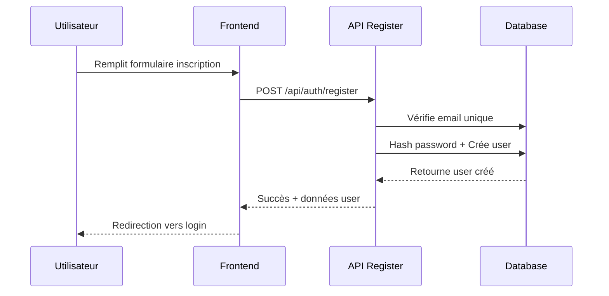
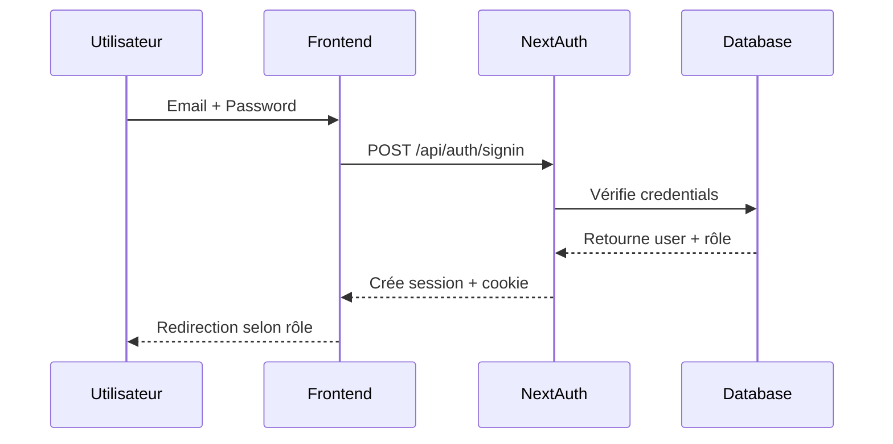
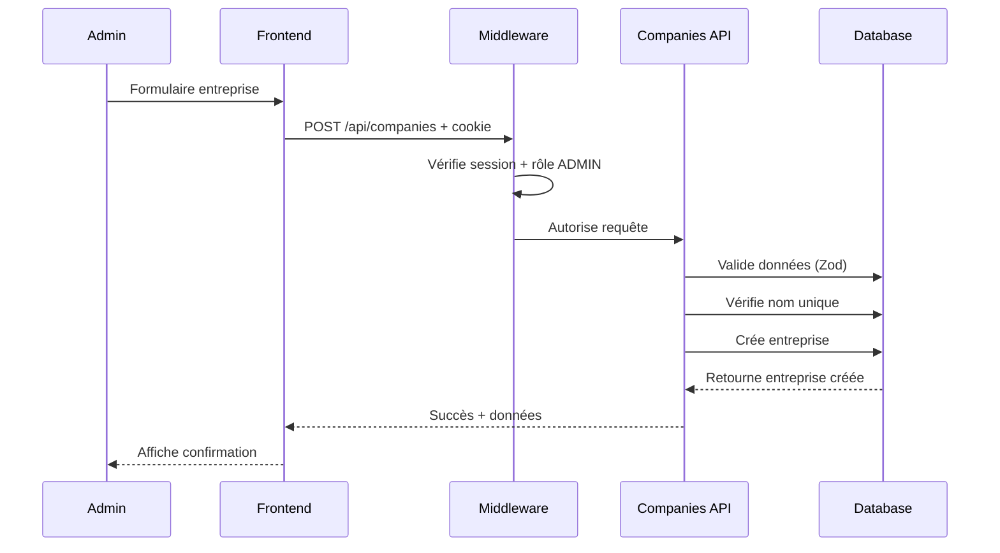
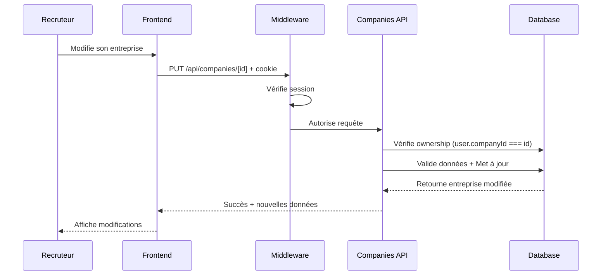

# Guide d'Architecture - Job Board

##  Vue d'ensemble

Cette application Job Board est construite avec **Next.js 13+** (App Router), **TypeScript**, **Prisma ORM**, **PostgreSQL**, et **NextAuth.js**. Elle permet aux candidats de chercher des emplois, aux recruteurs de poster des offres, et aux admins de gérer la plateforme.

##  Rôles et Permissions

###  **USER (Candidat)**
- Voir les offres d'emploi
- Postuler aux offres
- Gérer son profil
- Voir ses candidatures

###  **RECRUITER (Recruteur)**
- Toutes les permissions USER +
- Créer/modifier/supprimer ses offres d'emploi
- Voir les candidatures pour ses offres
- Modifier les informations de son entreprise

###  **ADMIN (Administrateur)**
- Toutes les permissions +
- Gérer tous les utilisateurs
- Gérer toutes les entreprises
- Gérer toutes les offres d'emploi
- Voir toutes les candidatures
- Accès aux statistiques globales

---

##  Structure des Fichiers et Rôles

###  **Base de Données (Prisma)**

```
prisma/
├── schema.prisma          # Schéma de la base de données
└── migrations/            # Historique des migrations
```

**`schema.prisma`** - Définit la structure de la base de données :
- **Models** : User, Company, Job, JobApplication
- **Enums** : Role (USER/RECRUITER/ADMIN), JobType (CDI/CDD/Stage/Freelance)
- **Relations** : User ↔ Company, Company ↔ Job, Job ↔ JobApplication

###  **Authentification**

```
src/lib/
├── auth.ts               # Configuration NextAuth.js
├── prisma.ts            # Client Prisma singleton
└── swagger.ts           # Configuration Swagger/OpenAPI
```

**`auth.ts`** - Gère l'authentification :
- Configuration NextAuth.js avec Prisma adapter
- Stratégie de connexion par email/password
- Gestion des sessions et callbacks
- Injection du rôle utilisateur dans la session

###  **APIs Backend**

```
src/app/api/
├── auth/
│   ├── [...nextauth]/route.ts    # Endpoints NextAuth.js
│   └── register/route.ts         # Inscription utilisateur
├── companies/
│   ├── route.ts                  # GET/POST /api/companies
│   └── [id]/route.ts            # GET/PUT/DELETE /api/companies/[id]
├── jobs/                         # À implémenter
├── applications/                 # À implémenter
├── users/                       # À implémenter
└── swagger/route.ts             # Spec OpenAPI JSON
```

**APIs Companies** :
- **GET /api/companies** : Liste paginée avec recherche
- **POST /api/companies** : Créer entreprise (ADMIN seulement)
- **GET /api/companies/[id]** : Détails avec jobs et recruteurs
- **PUT /api/companies/[id]** : Modifier (ADMIN ou RECRUITER de l'entreprise)
- **DELETE /api/companies/[id]** : Supprimer (ADMIN seulement)

###  **Frontend (Pages)**

```
src/app/
├── layout.tsx               # Layout principal avec SessionProvider
├── page.tsx                # Page d'accueil
├── loading.tsx             # Page de chargement
├── not-found.tsx           # Page 404
├── auth/
│   ├── layout.tsx          # Layout pour les pages d'auth
│   ├── login/page.tsx      # Page de connexion
│   └── register/page.tsx   # Page d'inscription
├── api-docs/page.tsx       # Documentation Swagger UI
├── admin/                  # Pages admin (à implémenter)
└── (public)/              # Pages publiques (à implémenter)
```

###  **Composants**

```
src/components/
├── SessionProvider.tsx     # Provider NextAuth.js côté client
└── layout/
    └── Header.tsx         # Header avec navigation conditionnelle
```

###  **Middleware**

```
src/middleware.ts          # Protection des routes selon les rôles
```

**Middleware** - Protège les routes :
- Vérifie l'authentification
- Contrôle les permissions par rôle
- Redirige vers login si non authentifié

---

## Flux de Communication

### **Inscription d'un Utilisateur**



###  **Connexion et Session**



### **Création d'une Entreprise (ADMIN)**



### **Modification d'Entreprise (RECRUITER)**



---

##  Sécurité et Validation

### **Niveaux de Protection**

1. **Middleware** : Vérifie l'authentification et les rôles
2. **API Routes** : Double vérification des permissions
3. **Zod Validation** : Validation des données côté serveur
4. **Prisma** : Protection contre l'injection SQL
5. **NextAuth** : Gestion sécurisée des sessions

### **Exemple de Sécurité Multi-Niveaux**

```typescript
// 1. Middleware vérifie l'auth
export function middleware(request: NextRequest) {
  // Vérifie si utilisateur connecté
}

// 2. API vérifie les permissions
export async function PUT(request: NextRequest) {
  const session = await getServerSession(authOptions)
  
  // Vérifie rôle
  if (session.user.role !== 'ADMIN' && session.user.companyId !== id) {
    return NextResponse.json({ error: 'Accès refusé' }, { status: 403 })
  }
  
  // 3. Zod valide les données
  const validatedData = updateCompanySchema.parse(body)
  
  // 4. Prisma exécute la requête sécurisée
  const company = await prisma.company.update({ ... })
}
```

---

## Flux de Données

### **Architecture en Couches**

```
┌─────────────────────────────────────────┐
│               FRONTEND                  │
│  ┌─────────────────────────────────────┐ │
│  │     React Components (TSX)          │ │ ← Interface utilisateur
│  │   - Pages (login, register, etc.)  │ │
│  │   - Components (Header, etc.)      │ │
│  └─────────────────────────────────────┘ │
└─────────────────────────────────────────┘
                    ↕ HTTP/JSON
┌─────────────────────────────────────────┐
│              MIDDLEWARE                 │
│  ┌─────────────────────────────────────┐ │
│  │        Route Protection             │ │ ← Sécurité
│  │   - Authentification               │ │
│  │   - Autorisation par rôle          │ │
│  └─────────────────────────────────────┘ │
└─────────────────────────────────────────┘
                    ↕ 
┌─────────────────────────────────────────┐
│            API ROUTES                   │
│  ┌─────────────────────────────────────┐ │
│  │      Business Logic                 │ │ ← Logique métier
│  │   - Validation (Zod)               │ │
│  │   - Permissions                    │ │
│  │   - Transformation données         │ │
│  └─────────────────────────────────────┘ │
└─────────────────────────────────────────┘
                    ↕ SQL
┌─────────────────────────────────────────┐
│              DATABASE                   │
│  ┌─────────────────────────────────────┐ │
│  │         PostgreSQL                  │ │ ← Stockage
│  │   - Users, Companies, Jobs          │ │
│  │   - Relations, Contraintes          │ │
│  │   - Indexation                     │ │
│  └─────────────────────────────────────┘ │
└─────────────────────────────────────────┘
```

---

##  Démarrage et Développement

### **1. Installation**
```bash
git clone [repo]
cd job-board
npm install
```

### **2. Configuration Base de Données**
```bash
cp .env.example .env.local
# Configurer DATABASE_URL dans .env.local
npx prisma db push
```

### **3. Développement**
```bash
npm run dev
# Serveur : http://localhost:3000
# Swagger : http://localhost:3000/api-docs
```

### **4. Tests API**
- **Swagger UI** : Interface interactive
- **Postman** : Collection disponible dans `SWAGGER_TESTS.md`
- **Comptes de test** :
  - Admin : `admin@jobboard.com` / `password123`
  - Recruteur : `recruiter@company.com` / `password123`
  - User : `user@example.com` / `password123`

---

##  Prochaines Étapes

### **APIs à Implémenter**
1. **Jobs API** (`/api/jobs/*`)
2. **Applications API** (`/api/applications/*`)
3. **Users API** (`/api/users/*`)

### **Pages Frontend à Créer**
1. **Pages publiques** : Liste jobs, détails job
2. **Pages utilisateur** : Profil, candidatures
3. **Pages admin** : Dashboard, gestion

### **Fonctionnalités Avancées**
1. **Upload de CV**
2. **Notifications email**
3. **Recherche avancée**
4. **Statistiques**

---

##  Collaboration Équipe

### **Répartition Suggérée**
- **Personne A** : APIs Jobs + Companies ✅
- **Personne B** : APIs Applications + Users
- **Personne C** : Pages Frontend publiques
- **Personne D** : Pages Admin + Dashboard

### **Standards de Code**
- **TypeScript** strict
- **Validation Zod** pour toutes les APIs
- **Tests** avec exemples Swagger
- **Sécurité** : toujours vérifier les permissions

---

## Support

- **Documentation API** : http://localhost:3000/api-docs
- **Schéma DB** : `prisma/schema.prisma`
- **Tests** : `SWAGGER_TESTS.md`
- **Architecture** : Ce fichier !

